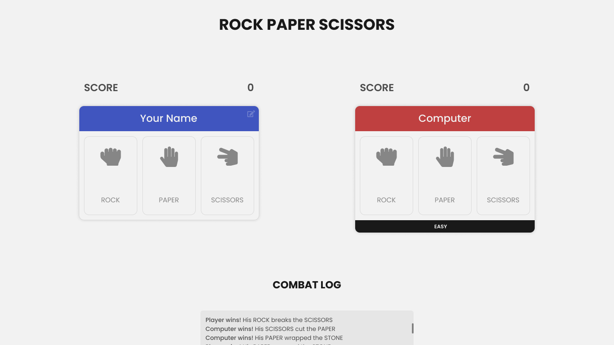
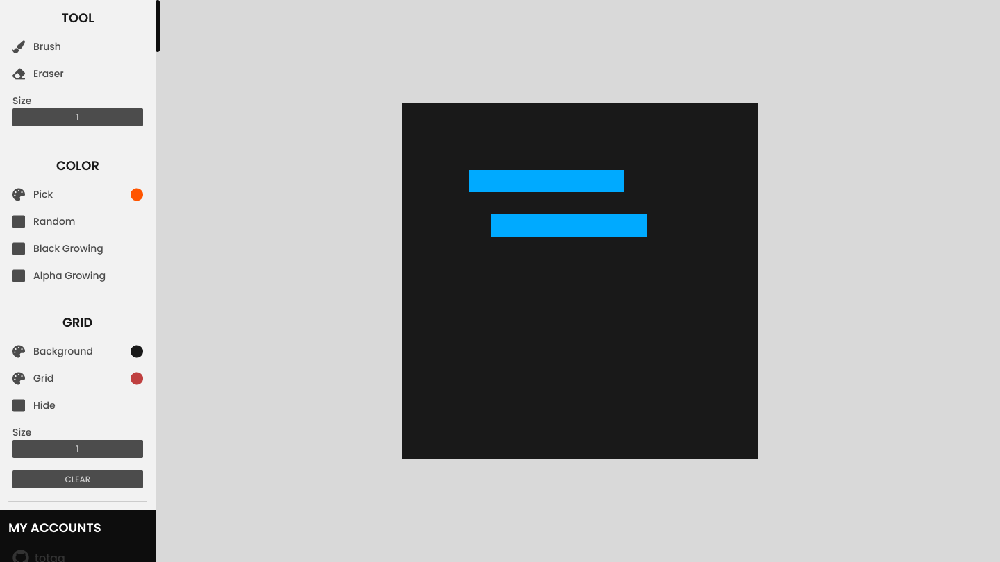
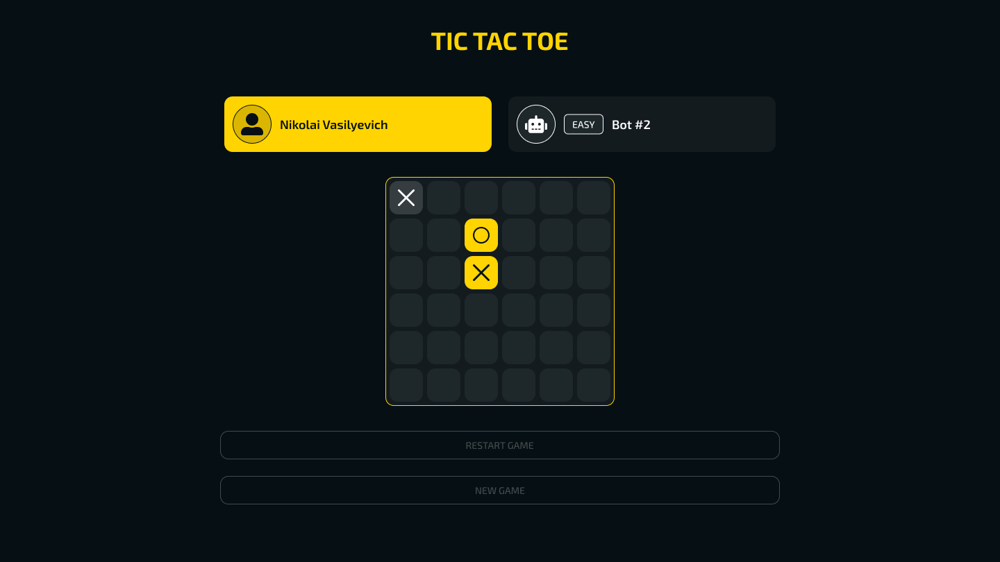
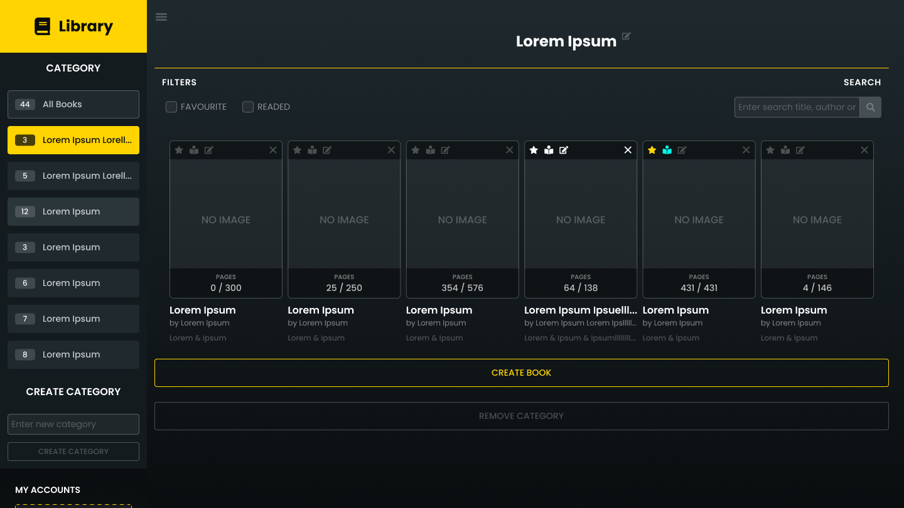
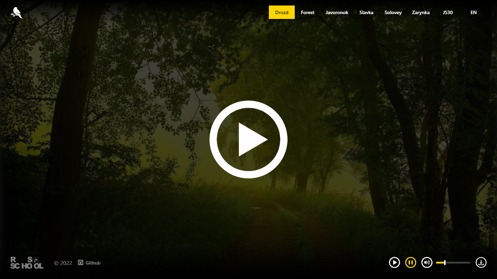
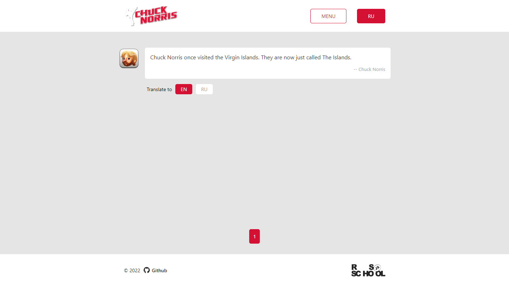
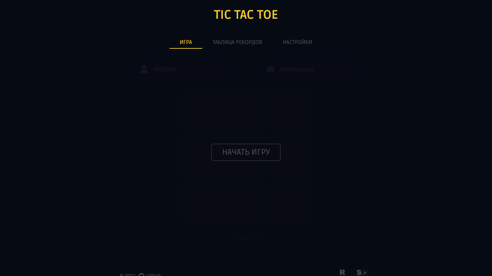

# Vyacheslav, Fyur


**Hi, I'm Fyur a web developer**
I have been looking for something that I like for a long time, tried many different directions, they included: development of modifications, games, applications. I am currently studying Front-End development, I am also planning to study Back-End development. I like it and I am ready to develop in this direction.

## Skills

| Language / Framework | Level           |
| --                   | --              |
| HTML                 | Above average   |
| CSS                  | Above average   |
| JavaScript           | Above average   |
| Figma                | High            |
| Github               | Average         |
| Git                  | Average         |
| NodeJS               | Below average   |
| Webpack              | Low             |
| React                | Low             |
| Java                 | Below average   |
| Python               | Low             |
| Database             | Low             |

## Code Example

**JavaScript - [Replace With Alphabet Position](https://www.codewars.com/kata/546f922b54af40e1e90001da)**

```javascript
function alphabetPosition(str) {
  return str
  .replace(/[^a-z]/ig, "")
  .split("")
  .map((char) => char.toUpperCase().charCodeAt(0) - 64)
  .join(" ");
}
```

**JavaScript - [Clocky Mc Clock-Face](https://www.codewars.com/kata/59752e1f064d1261cb0000ec)**

```javascript
function whatTimeIsIt(angle) {
  const hours = Math.floor(angle / 30) || 12;
  const minutes = Math.floor((angle % 30 * 2));

  return String(hours).padStart(2, "0") + ":" + String(minutes).padStart(2, "0");
}
```

## Portfolio

### Rock Papper Scissors



A small application for playing rock-paper-scissors. It is possible to choose a game against a computer that has 3 difficulty levels.

Stack: HTML, CSS, JavaScript

[Website](https://totgg.github.io/odin-rock-paper-scissors/)
[Source](https://github.com/totgg/odin-rock-paper-scissors/)

---

### Etch a Sketch



An application for pixel drawing! There are two tools, a brush and an eraser, the ability to adjust their size, the choice of color for drawing and other settings. Canvas was used for drawing, but it was not done so well.

Stack: HTML, CSS, JavaScript

[Website](https://totgg.github.io/odin-etch-a-sketch/)
[Source](https://github.com/totgg/odin-etch-a-sketch/)

---

### Tic Tac Toe



A well-known game from childhood, tic-tac-toe! You can play against the computer with 4 different difficulty levels. Easy, medium, difficult and impossible! You can even force two computers to play against each other. The minimax algorithm was implemented for the computer.

Stack: HTML, CSS, JavaScript

[Website](https://totgg.github.io/odin-tic-tac-toe/)
[Source](https://github.com/totgg/odin-tic-tac-toe/)

---

### Books Library



This is a small personal library of books for the user. You can add categories, books and even delete them. Have you lost something? Use the search! Find the added book by its title, author, or genre.

Stack: HTML, CSS, JavaScript

[Website](https://totgg.github.io/odin-books-library/)
[Source](https://github.com/totgg/odin-books-library/)

---

### Eco Sounds



A small website for relaxation with birdsong and the possibility of choosing birds.

Stack: HTML, CSS, JavaScript

[Website](https://rolling-scopes-school.github.io/totgg-JSFEPRESCHOOL/eco-sounds/)

---

### Random Jokes



The application is based on the [Chuck Norris API](https://api.chucknorris.io/), you can get random quotes, random quotes from a category or find a quote by keywords.

Stack: HTML, CSS, JavaScript

[Website](https://rolling-scopes-school.github.io/totgg-JSFEPRESCHOOL/random-jokes/)

---

### Tic Tac Toe - 2



There are no significant differences from the previous project, on the contrary, some functionality has been cut.

Stack: HTML, CSS, JavaScript

[Website](https://rolling-scopes-school.github.io/totgg-JSFEPRESCHOOL/tic-tac-toe/)

---

## Courses

- [Rolling Scopes School](https://rs.school/)
  - This platform introduced me to deadlines and the importance of properly allocating my time, some useful practices in development, and of course a good community
  - Current courses:
    - JavaScript/Front-end 2022Q1
  - Completed courses:
    - JS/FE Pre-School 2022
- [The Odin Project](https://www.theodinproject.com)
  - This course introduced me very well to HTML, CSS, JavaScript, NodeJS, Webpack, React, Git, Github
  - Current courses:
    - Full Stack JavaScript
  - Completed courses:
    - Foundations
- [freeCodeCamp](https://www.freecodecamp.org/)
  - This platform introduced me to Responsive Design, JavaScript, React, Redux, SASS, jQuery, Bootstrap
  - Current courses:
    - Front End Development Libraries
    - Data Visualization
    - Back End Development and API
  - Completed courses:
    - Responsive Web Design
    - JavaScript Algorithms and Data Structures
- [Hypeskill](https://hyperskill.org)
  - This platform introduced me to Java
  - Completed courses:
    - Java for Beginners
    - Java Developer
    - Java Desktop Application Developer
    - Java Backend Developer
    - Java Core

## Language

| Language / Framework | Level           |
| --                   | --              |
| Russian              | Native          |
| English              | Beginner        |

## Contacts

| Discord  | Telegram |
| --       | --       |
| [Fyur#9245](https://discordapp.com/users/862343180246319144) | [@dear_lime](https://t.me/dear_lime) |
